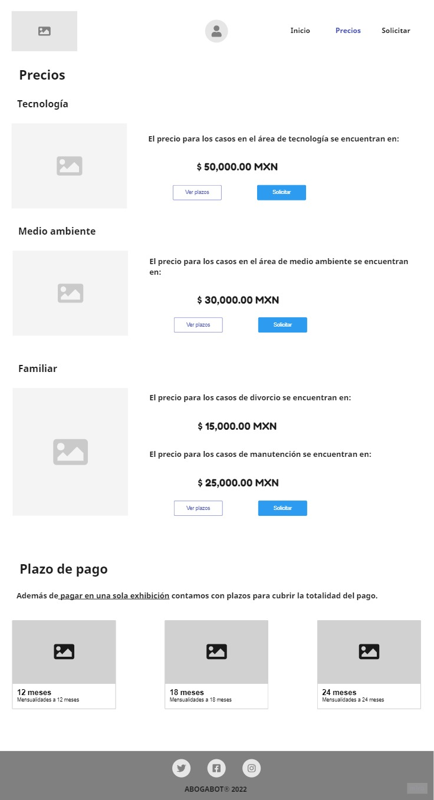

# mf_requerimientos

A lo largo de este repositorio se podrá encontrar la primera etapa del desarrollo de software, la cual consiste en toma de requerimientos, realización de wireframes.

Los requirimientos se toman a partir del siguiente enunciado:

> ### Caso **'abogabot'**
>
> -   Es un despacho de abogados que quiere automatizar las demandas de sus clientes, esto lo harán a traves de una página web llenando un formulario.
> -   Al momento de llenar el formulario se manda al proceso de pago para finalizar la transacción.
> -   Para dar seguimiento a su demanda, el cliente crea una cuenta en la plataforma y verá el seguimiento de cada una de las actualizaciones del proceso legal.
> -   El administrador del sitio recbe la notificación de una nueva demanda y con los datos llenados del formulario se crea automaticamente el documento legal en formato word para empezar el proceso.
> -   El administrador recibe el pago y debe de ser capaz de verlo en un dashboard para ver la cantidad de ingresos recibidos.
> -   El administrador actualiza el proceso de la demanda y agrega comentarios en cada paso del proceso.
> -   Al usuario le llegan correos de notificación para saber el avance de su proceso.
> -   La página debe de ser responsive para poderla ver desde el celular.
> -   La preferncia de colores del cliente es azul marino y blanco, pero acepta propuestas.

---

## Wireframes

Las imagenes presentadas a continuación corresponden a los Wireframes realizados para una aplicación web.

Para ver los wireframes completos en la [solución en Miro®](https://miro.com/app/board/uXjVPLWNkTk=/?share_link_id=78250641744)

---

## UI

Las imagenes siguientes son parte del UI diseñado a partir de los Wireframes mostrados anteriormente.

Para ver el diseño completo accede al prototipo semifuncional en [Figma®](https://www.figma.com/proto/Y7foxEfHGdCYXZRDZDBvkR/Abogabot?node-id=10%3A8&scaling=scale-down&page-id=0%3A1&starting-point-node-id=10%3A8).

---

> ### **_Nota_**
>
> _Aunque una **toma de requerimientos** se debe **realizar a través de instrumentos** como entrevistas, cuestionarios u otros que se deben realizar al cliente; este caso se nos pidio realizar una toma de requerimientos con base sólo en lo enunciado anteriormente_
